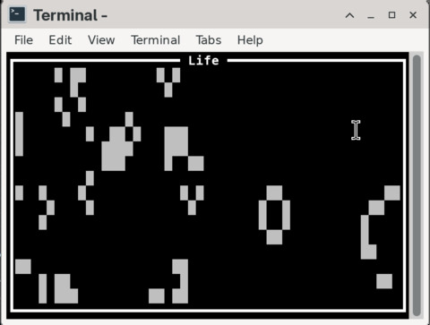

# Rust Life

This is an experiment to get better at Rust programming in general, and
also to learn more about [Ratatui].



## Controls

Roguelike cursor keys:

```
y k u
 \|/
h-+-l
 /|\
b j n
```

```
s: Step
q: Quit
```

## TODO

* Add keys and functionality:
  * Randomize
  * Clear board
  * Set/clear cell
  * Run/stop
  * Help
  * About
* Cheat sheet on bottom bar
* Colors
* Doc comments

